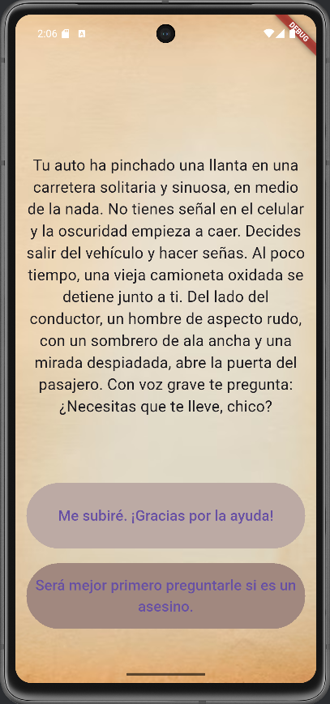

# Destiny - App de Historia Interactiva

**Destiny** es una aplicación desarrollada en Flutter y Dart que simula una historia interactiva donde el usuario puede tomar decisiones que afectan el desarrollo y desenlace de la narrativa. Inspirada en los libros "Elige tu propia aventura", permite al usuario explorar diferentes caminos narrativos a través de una interfaz visual sencilla y atractiva.

---

## 🧠 Descripción general

El usuario se encuentra con distintas situaciones descritas en pantalla, junto con dos posibles elecciones. Dependiendo de la opción seleccionada, la historia cambia y puede llevar a diferentes finales. Al llegar a un final, el usuario puede reiniciar la aventura para probar otros caminos.

---

## 👁 Vista App
<p align="center">
  
</p>

---

## 🚀 Funcionalidades principales

- Presentación secuencial de una historia interactiva.
- Dos opciones posibles por cada escena para decidir el rumbo de la historia.
- Finales múltiples según las decisiones del usuario.
- Reinicio automático al finalizar la historia.
- Interfaz visual con fondo ilustrativo.

---

## 📦 Requisitos del proyecto

- Flutter SDK >= 3.29.3
- Dart >= 3.7.2
- Un editor como Visual Studio Code o Android Studio.
- Emulador o dispositivo físico para pruebas.

---

## 🛠️ Tecnologías y paquetes utilizados

- **Flutter**: Framework para el desarrollo de interfaces multiplataforma.
- **Dart**: Lenguaje de programación principal.
- No se usaron paquetes externos adicionales.

---

## 📁 Estructura del proyecto
```
/images
│
└── background.png
/lib
│
├── main.dart # Punto de entrada de la aplicación, interfaz principal.
├── story_brain.dart # Controlador de lógica narrativa y navegación entre historias.
└── story.dart # Modelo de datos que define la estructura de una historia.
```
---

## 👤 Autor

Desarrollado por **María José Mendieta Ortiz**   
🌐 https://github.com/MariaJoseMendieta
